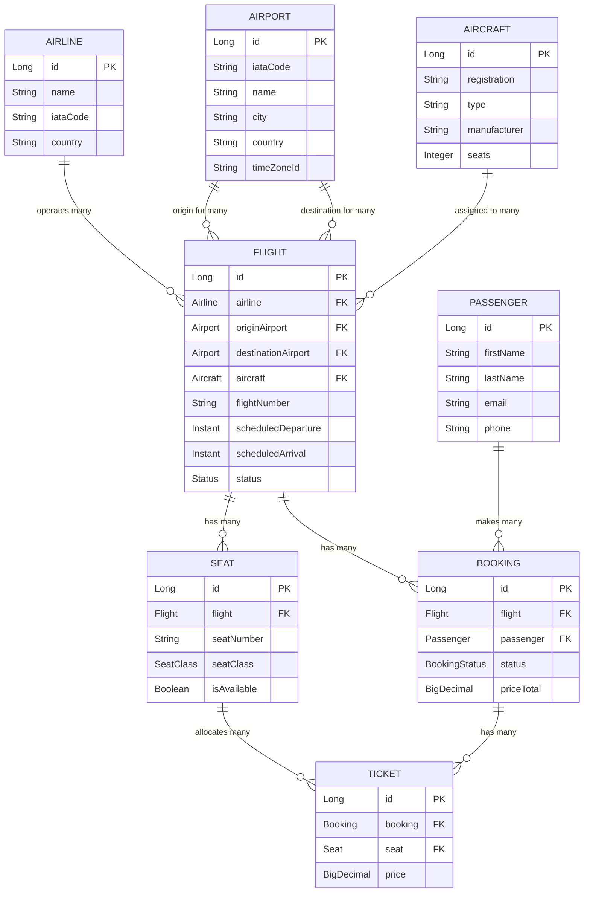

```mermaid
erDiagram
    AIRLINE    ||--o{ FLIGHT    : "operates many"
    AIRPORT    ||--o{ FLIGHT    : "origin for many"
    AIRPORT    ||--o{ FLIGHT    : "destination for many"
    AIRCRAFT   ||--o{ FLIGHT    : "assigned to many"

    FLIGHT     ||--o{ SEAT      : "has many"
    FLIGHT     ||--o{ BOOKING   : "has many"
    PASSENGER  ||--o{ BOOKING   : "makes many"
    BOOKING    ||--o{ TICKET    : "has many"
    SEAT       ||--o{ TICKET    : "allocates many"

    AIRLINE {
        Long   id PK
        String name
        String iataCode
        String country
    }

    AIRPORT {
        Long   id PK
        String iataCode
        String name
        String city
        String country
        String timeZoneId
    }

    AIRCRAFT {
        Long    id PK
        String  registration
        String  type
        String  manufacturer
        Integer seats
    }

    FLIGHT {
        Long     id PK
        Airline  airline           FK
        Airport  originAirport     FK
        Airport  destinationAirport FK
        Aircraft aircraft          FK
        String   flightNumber
        Instant  scheduledDeparture
        Instant  scheduledArrival
        Status   status
    }

    PASSENGER {
        Long   id PK
        String firstName
        String lastName
        String email
        String phone
    }

    BOOKING {
        Long          id PK
        Flight        flight        FK
        Passenger     passenger     FK
        BookingStatus status
        BigDecimal    priceTotal
    }

    SEAT {
        Long       id PK
        Flight     flight       FK
        String     seatNumber
        SeatClass  seatClass
        Boolean    isAvailable
    }

    TICKET {
        Long        id PK
        Booking     booking     FK
        Seat        seat        FK
        BigDecimal  price
    }

```